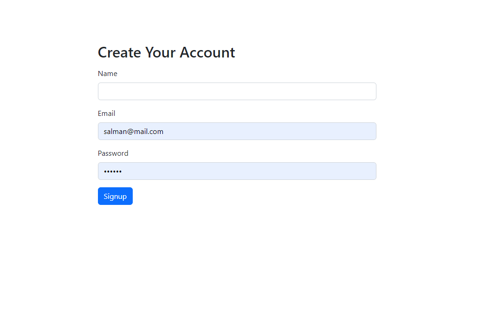
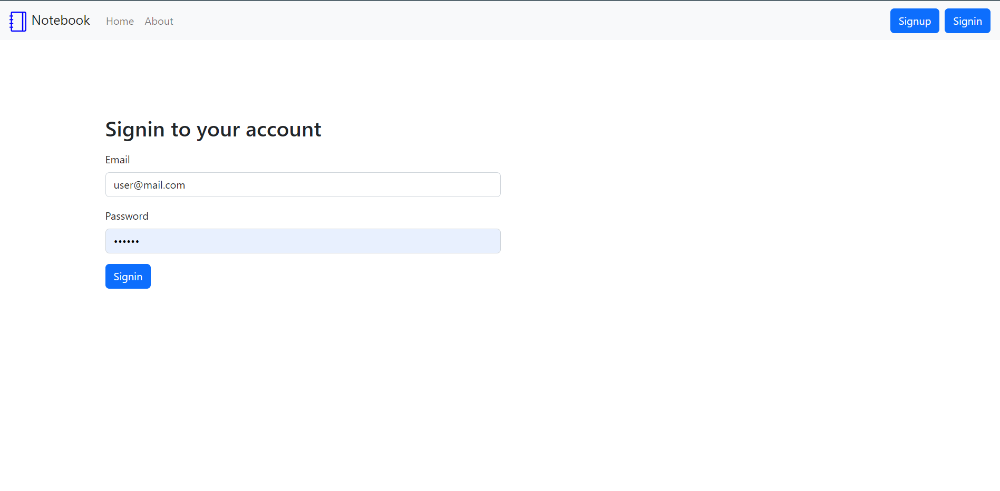
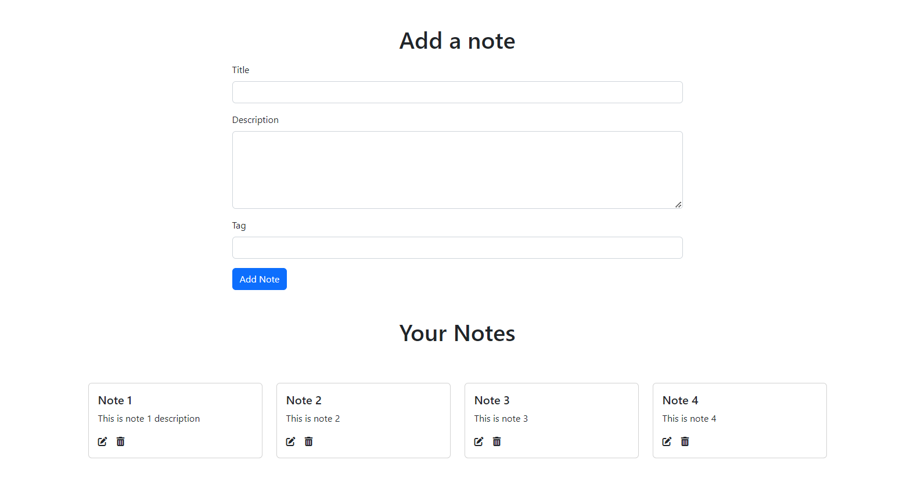

# Online-Todolist

## An online note taking app

# [Live](https://mynotebook.cyclic.app/)

## Screenshots

## About
This is an online note taking app

### Functionality
- Add, Delete, Update Note
- User Signin, Signout option
- A user must be signed in to use this app
- One user can not see or modify other users notes

## Built With

